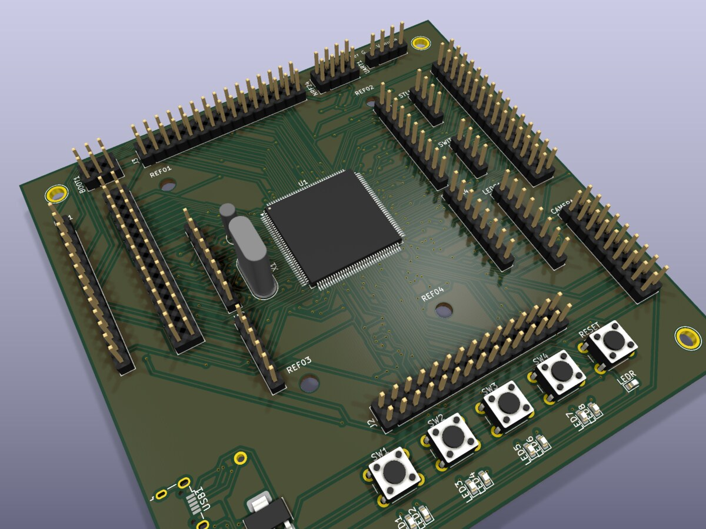

# ARM Processor PCB Design (KiCad)

PCB design for an ARM-based board ("ArmVaquita"), from schematic capture through component placement and trace routing, built in KiCad.

## What's in this repo

- `ArmVaquita.kicad_pro` / `.kicad_pcb` — earlier board revision
- `Placa routeada/` — final routed version (`PLACAROUTEADA.kicad_pcb`), fully routed with copper pours and vias
- `Plot/` — exported Gerber/drill files, ready for fabrication

## Board features

- ARM Cortex-M MCU in QFP package as the central component
- USB connector for power/programming
- 4 user pushbuttons + reset button
- 8 status LEDs
- Multiple expansion headers (BOOT, camera interface, general I/O)
- Full 2-layer routing with ground pour

The 3D render above was generated directly from the routed board file with `kicad-cli pcb render`.
